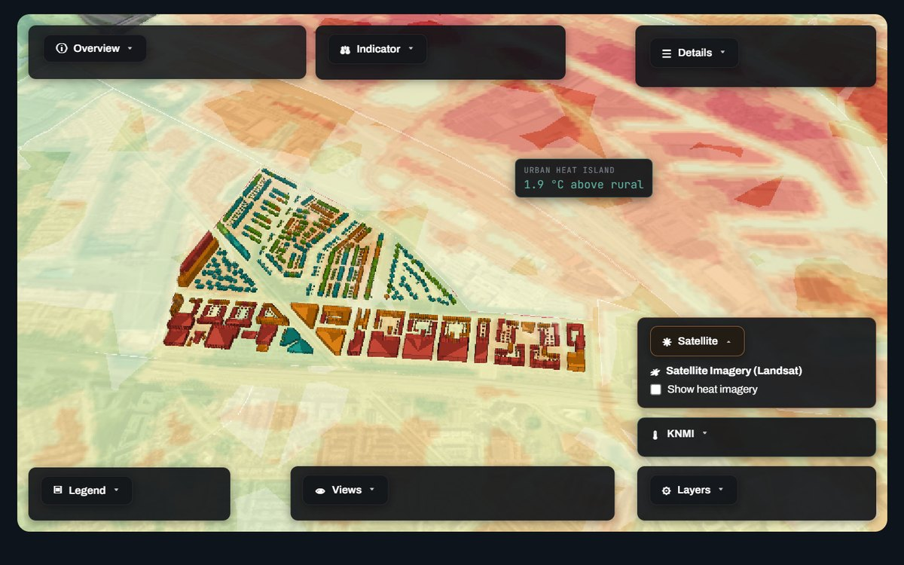
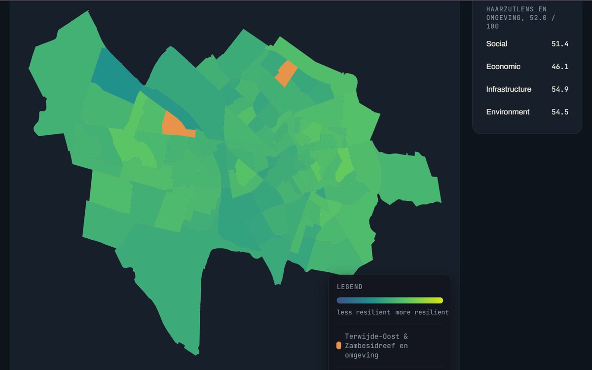
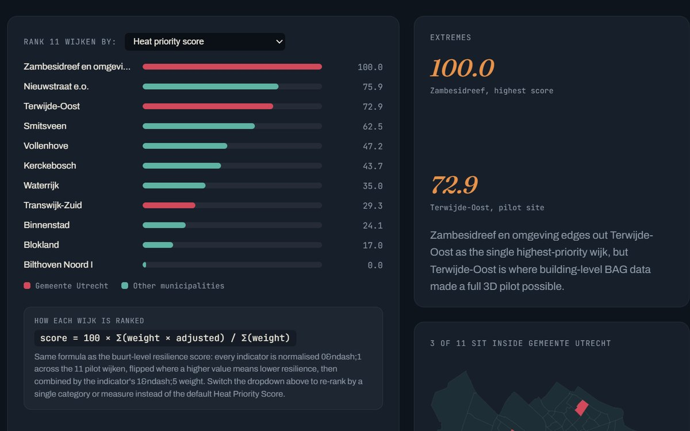
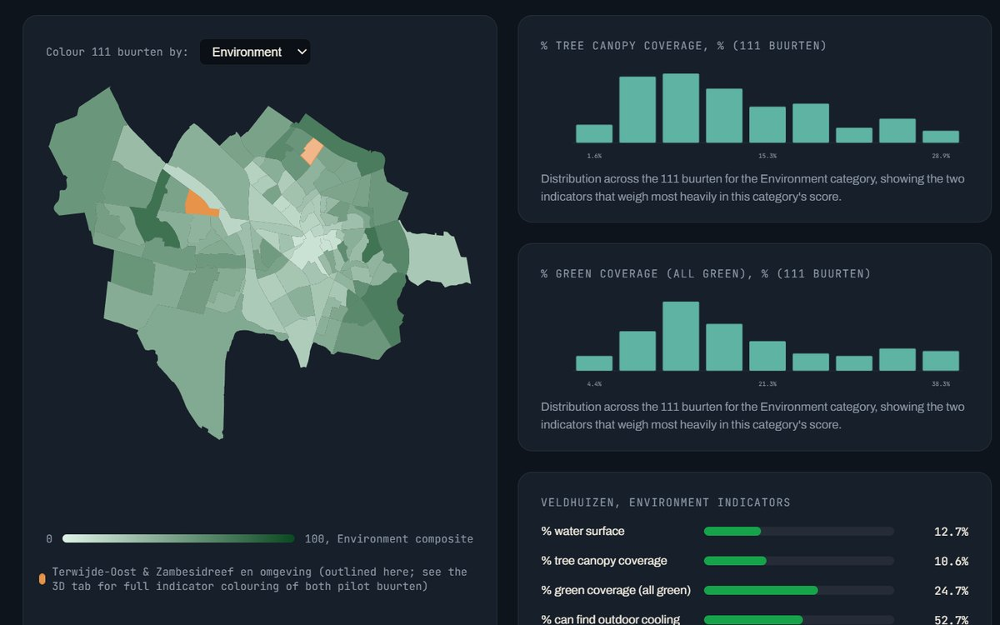

# Heat Resilience Digital Twin — Veiligheidsregio Utrecht

**Internship project, June to September 2026.** Utrecht, the Netherlands.

When a heatwave hits a city, the damage is not spread evenly. It lands on the
people who are old, alone, or living under a roof with no shade and no way to
cool down. A safety region usually finds out where those people were after the
fact. This project asks whether it can be seen beforehand, on a map.

The prototype scores **all 111 CBS buurten in Gemeente Utrecht on 28 weighted
indicators**, ranks 11 candidate wijken across six municipalities, and drops
into a 3D digital twin of two pilot neighbourhoods built from **2,608 real
buildings** at real BAG heights, each classified by the land surface temperature
measured over it by Landsat.

Every figure in it comes from a published source. Nothing is sample data.

---

## What it does

**Six linked views, country down to single building.** Nederland → Provincie
Utrecht → Gemeente Utrecht → resilience score → wijk ranking → the 3D twin.
Each level answers the question the one above it raises.

**One composite score, honestly built.**

```
resilience score = 100 × Σ(weight × adjusted) / Σ(weight)
```

Every indicator is normalised across the 111 buurten and flipped where a higher
raw number means lower resilience: more over-65s, more severe loneliness, more
hardened surface. Every indicator states, on screen, which way it points and
whether the score inverts it, read from the same flag the scoring pipeline uses,
so the explanation cannot drift from the calculation.

**Real thermal data.** Eight Landsat 8/9 dates across summer 2026, cloud-masked,
clipped to the municipal boundary, with a per-date temperature grid so clicking
the map returns degrees Celsius. Labelled as land surface temperature, never
mixed with air temperature, because on a sunny day a roof reads far hotter than
the air above it.

**Live layers.** Current air temperature from the KNMI Harmonie model, KNMI
daily measured grids, and Klimaateffectatlas urban heat island, warm nights,
perceived temperature and distance-to-cool-place layers, each carrying its own
provenance: how it was produced, when it was collected, and which years it
compares.

**Missing data shown as missing.** Where CBS or RIVM suppress a value because
the underlying counts are too small to publish safely, the map says so and names
the count. It does not draw a zero and let the colour ramp imply something.

---

## Built with

Python for the data pipeline (pandas, geopandas, rasterio, shapely), CesiumJS
for the 3D twin, QGIS for spatial work, and a single self-contained HTML
dashboard with no build step and no framework.

Data from CBS, RIVM, KNMI, Klimaateffectatlas, USGS Landsat, PDOK BAG, the NWB
road network, OpenStreetMap and Gemeente Utrecht's tree register.

---

## Screenshots

Four views from the prototype: the wijk ranking, the composite resilience score
across all 111 buurten, the indicator maps for Gemeente Utrecht, and the 3D
digital twin with its environment layers.

| | |
|---|---|
|  |  |
|  |  |

---

## Source code

The full project, including the data pipeline, all build scripts and the written
reports, is in a private repository: it is internship work carried out for
Veiligheidsregio Utrecht. Happy to walk through it on request.

---

Built by **Ishraque** during an internship at Veiligheidsregio Utrecht,
June to September 2026.
