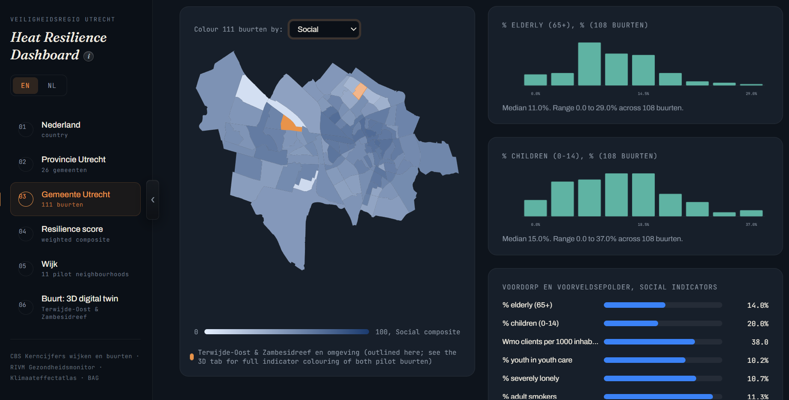
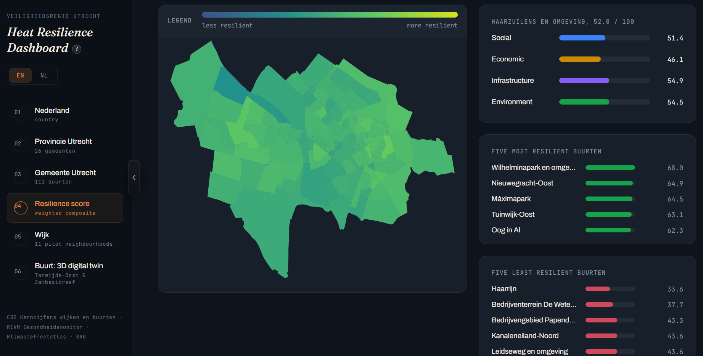
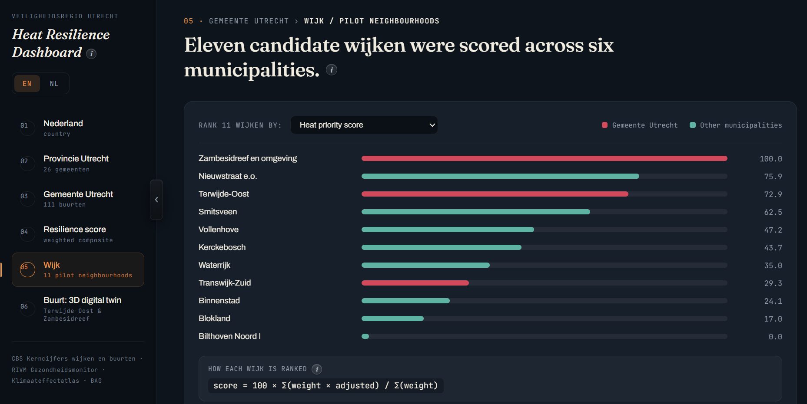
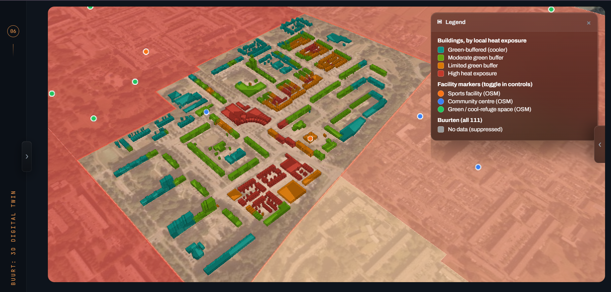
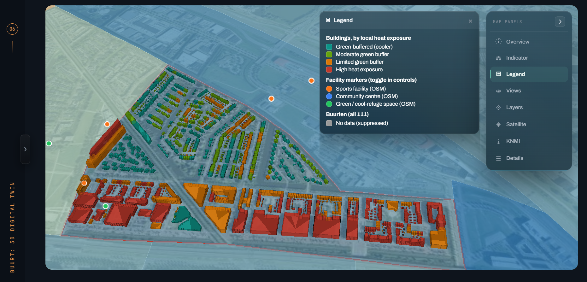

# Heat Resilience Digital Twin — Veiligheidsregio Utrecht

**Internship project, June to September 2026.** Utrecht, the Netherlands.

When a heatwave hits a city, the damage is not spread evenly. It lands on the
people who are old, alone, or living under a roof with no shade and no way to
cool down. A safety region usually finds out where those people were after the
fact. This project asks whether it can be seen beforehand, on a map.

The prototype scores **all 111 CBS buurten in Gemeente Utrecht on 28 weighted
indicators**, ranks 11 candidate wijken across six municipalities, and drops
into a 3D digital twin of two pilot neighbourhoods built from **2,608 real
buildings** at real BAG heights, each classified by the land surface temperature
measured over it by Landsat.

Every figure in it comes from a published source. Nothing is sample data.

---

## Gemeente Utrecht — 111 buurten, by indicator category



Pick a category and the map recolours. The two charts are the distribution of
the indicators feeding it, each with its own median and range: 11.0% over-65s
and 15.0% children here, both across 108 buurten rather than 111, because CBS
suppresses a value where the underlying counts are too small to publish safely.
The panel on the right is whichever buurt is under the cursor.

## Resilience score — one number per buurt



```
resilience score = 100 × Σ(weight × adjusted) / Σ(weight)
```

Every indicator is normalised across the 111 buurten and flipped where a higher
raw number means lower resilience: more over-65s, more severe loneliness, more
hardened surface. Hovering a buurt breaks its score into the four categories, so
you can see *what* is dragging it down rather than just how far.

Haarrijn sits at 33.6, Wilhelminapark at 68.0. Both ranked lists are computed
from the same data the map is drawn from, so they cannot drift apart.

## Wijk — eleven candidates, six municipalities



The shortlist that picked the pilots, re-rankable by any single indicator that
feeds the score. Red is Gemeente Utrecht, teal is everywhere else. Zambesidreef
en omgeving tops it at 100.0, Terwijde-Oost follows at 72.9, and the ranking
reshuffles completely depending on which input you rank by.

## Buurt — the 3D digital twin



Terwijde-Oost at building level. Every building stands at its real BAG height
and carries the heat exposure measured over it, from green-buffered through to
high. The dots are sports facilities, community centres and green or cool refuge
spaces within walking distance. The buurten around it keep their indicator
colour, so the pilot is read in context rather than on its own.



The second pilot, Zambesidreef en omgeving, under the live KNMI air temperature
layer. Every panel on the right is independent: overview, indicator, legend,
views, layers, satellite, KNMI and details can each be opened, stacked or tucked
away, so the map keeps the screen.

---

## What is behind it

**Real thermal data.** Eight Landsat 8/9 dates across summer 2026, cloud-masked,
clipped to the municipal boundary, with a per-date temperature grid so clicking
the map returns degrees Celsius. Labelled as land surface temperature, never
mixed with air temperature, because on a sunny day a roof reads far hotter than
the air above it.

**Live layers.** Current air temperature from the KNMI Harmonie model, KNMI
daily measured grids, and Klimaateffectatlas urban heat island, warm nights,
perceived temperature and distance-to-cool-place layers, each carrying its own
provenance: how it was produced, when it was collected, and which years it
compares.

**Every indicator says which way it points.** More trees is good, more over-65s
is not, and the interface says so for all 28, reading the direction from the
same flag the scoring pipeline uses so the explanation cannot drift from the
calculation.

**Missing data shown as missing.** Where CBS or RIVM suppress a value, the map
says so and names the count. It does not draw a zero and let the colour ramp
imply something.

---

## Built with

Python for the data pipeline (pandas, geopandas, rasterio, shapely), CesiumJS
for the 3D twin, QGIS for spatial work, and a single self-contained HTML
dashboard with no build step and no framework.

Data from CBS, RIVM, KNMI, Klimaateffectatlas, USGS Landsat, PDOK BAG, the NWB
road network, OpenStreetMap and Gemeente Utrecht's tree register.

---

## Source code

The full project, including the data pipeline, all build scripts and the written
reports, is in a private repository: it is internship work carried out for
Veiligheidsregio Utrecht. Happy to walk through it on request.

---

Built by **Ishraque Bin Khalil** during an internship at Veiligheidsregio
Utrecht, June to September 2026.
